<div align="center">



<br>

**Print one QR code. Your customers scan, take a number, and go sit down.**
No app. No account. Nothing to install.

<br>


</div>

---

## What it is

```
Browser (owner console + public customer page)
   │  HTTPS · access token in memory · session in an HttpOnly cookie
   ▼
Diiwaan API  ──  Supabase Auth      (identity, sign-up, verification, resets)
   │         ──  Supabase Storage   (logos and branding art)
   │         ──  Web Push           ("your turn", even with the tab closed)
   ▼
MongoDB      (businesses, queues, tickets, services, members, analytics, audit)
```

Supabase owns credentials. MongoDB owns the application. **No authentication secret is
stored in the browser**: the refresh token is sealed with AES-256-GCM into an HttpOnly,
SameSite cookie that JavaScript cannot read, and the tab holds only a short-lived access
token in memory, renewed from that cookie on load and a minute before it expires. What is
left in `localStorage` is a theme preference, the customer's own ticket token, and a
read-through cache used while reconnecting.


## What it does

| | |
|---|---|
| **Multi-tenant by construction** | Every read and write is scoped to a business the caller belongs to, resolved server-side from the session. One company cannot reach another's customers, queue, reports, logos or analytics — enforced in the API, never in the interface. |
| **Bilingual, Somali first** | Soomaali is the default language and English the alternative. A phone set to English still opens in Somali; choosing otherwise is a decision the person makes and the device remembers. |
| **Brand studio** | Six art-directed palettes, each exactly five colours — an off-white, a near-black and three hues that form a family. Picking one repaints the entire product: dashboard, customer page, printed sign and PDF report. |
| **Customer display** | A second screen for a TV or spare monitor, in three layouts, sized to be read across a room. The cashier keeps working in the dashboard while it runs. |
| **Works offline** | A join made without signal is held on the device and completes itself when the phone reconnects. Nothing is invented on screen in the meantime. |
| **Told when it is their turn** | Web Push through the service worker, a vibration pattern matched to what the device supports, a tone, a screen wake lock, and — always — a full-screen state on the page itself. |
| **Real reports** | Branded PDFs whose text is real text: selectable, searchable, pasteable. |
| **Returning customers** | A name is remembered per company on the customer's own device, never on ours, and can be cleared in one tap. |

## Getting started

```bash
cp .env.example .env      # fill in SUPABASE_URL and SUPABASE_ANON_KEY
npm install               # also bundles supabase-js into web/vendor/
npm run dev               # http://localhost:4173
```

With `MONGODB_URI` empty, development runs a real MongoDB locally (via
`mongodb-memory-server`) and keeps its files in `.data/mongo`, so restarts do not wipe your
work. The first process to start publishes its connection string to `.data/mongo-uri`;
the seed script and the test suite join that same instance. Point `MONGODB_URI` at Atlas and
nothing else changes.

Optional sample data — never loaded by the running server:

```bash
npm run seed -- <supabase-user-id>          # or an email, with a service-role key set
```

### Supabase setup

1. Create a project and copy its URL and publishable (anon) key into `.env`.
2. Set `SESSION_SECRET` to a long random string — it seals the session cookie, and rotating
   it simply signs everyone out.
3. Create the branding bucket and its policies — the SQL lives in
   [server/migrations/001_branding_storage.sql](server/migrations/001_branding_storage.sql).
   Owners upload straight to storage under a folder named after their own user id; the
   policies make it impossible to write into anyone else's folder, and the API only accepts
   image URLs that live in that bucket.
4. In Authentication → Providers, keep email confirmation on for production.
5. Generate a VAPID key pair for customer notifications: `npx web-push generate-vapid-keys`,
   then set `VAPID_PUBLIC_KEY`, `VAPID_PRIVATE_KEY` and `VAPID_SUBJECT`. Without them push
   stays off and customers fall back to the in-page alert.
4. Recommended: turn on **leaked password protection** (Authentication → Policies) — Supabase's
   own advisor flags it as off by default:
   <https://supabase.com/docs/guides/auth/password-security#password-strength-and-leaked-password-protection>

`SUPABASE_SERVICE_ROLE_KEY` is optional. It is only needed for the server-side upload route
and for seeding by email; the app itself never asks the browser for it.

## The three actors

**Platform** — Diiwaan itself: the design system, the API, the QR encoder.

**Owner** — signs up, creates a business, configures the queue, brands the customer
experience, invites staff, prints the sign, works the desk. Roles are `owner`, `manager`,
`staff`, and the server enforces them: staff can call customers but cannot close the queue,
change branding, or invite anyone.

**Customer** — opens `/j/<slug>`, joins, and watches their place move. They never see another
customer's name or phone, never see the desk, and never need an account.

## Screens

| Route | Who | Screen |
| --- | --- | --- |
| `/` | anyone | Landing, sign up, sign in, password reset |
| `#/setup` | new owner | Four-step setup: business → queue → brand → QR |
| `#/queue` | desk | Now serving, next, add, skip, recall, pause, search, per-ticket actions |
| `#/overview` | owner | Today's numbers, up next, service performance, the join QR |
| `#/brand` | owner | Identity, colours, customer wording, QR studio, live preview |
| `#/settings` | owner | Business, Queue, Services, Staff, Account |
| `#/sign` | owner | The printable sign |
| `/j/<slug>` | customer | Join the queue |
| `/t/<slug>` | customer | Their ticket: position, wait, called, offline, finished |

## API

All owner routes require a Supabase access token and resolve the tenant server-side.

```
GET    /api/config                                    public runtime config
GET    /api/health
GET    /api/auth/me                                   profile + businesses (creates the profile, links invites)
PATCH  /api/auth/me

GET    /api/businesses                                only what the caller belongs to
POST   /api/businesses
GET    /api/businesses/slug-available/:slug
GET    |PATCH|DELETE /api/businesses/:businessId
POST   /api/businesses/:businessId/onboarded
PATCH  /api/businesses/:businessId/branding
PATCH  /api/businesses/:businessId/customer-experience
PATCH  /api/businesses/:businessId/qr

GET    /api/businesses/:businessId/queue              snapshot: queue, serving, waiting, counts
PATCH  /api/businesses/:businessId/queue              name, prefix, average service time
POST   /api/businesses/:businessId/queue/status       open | paused | closed
POST   /api/businesses/:businessId/queue/next
POST   /api/businesses/:businessId/queue/recall
POST   /api/businesses/:businessId/queue/tickets
POST   /api/businesses/:businessId/queue/tickets/:id/serving | skip | move | service | close

GET    /api/businesses/:businessId/services  (+ POST, PATCH, DELETE)
GET    /api/businesses/:businessId/members   (+ POST, PATCH, DELETE)
GET    /api/businesses/:businessId/analytics
GET    /api/businesses/:businessId/stream             SSE, authenticated

GET    /api/public/:slug                              business, branding, queue state, own ticket
POST   /api/public/:slug/join                         rate limited
POST   /api/public/:slug/leave
GET    /api/public/:slug/stream                       SSE, redacted

GET    /api/businesses/:businessId/report.pdf         branded PDF report (manager and above)
POST   /api/businesses/:businessId/queue/tickets/:id/call   call one waiting customer now

POST   /api/public/:slug/notify                       register this ticket for push
POST   /api/uploads/businesses/:businessId/logo       server-side upload (needs a service-role key)

POST   /api/auth/session                              store a fresh sign-in in the cookie
GET    /api/auth/session                              restore / renew from the cookie
DELETE /api/auth/session                              sign out
```

The three session endpoints require an `X-Diiwaan-Client: web` header. A browser will not
attach a custom header to a cross-site form post or image load, so a third-party page cannot
ride the cookie — and no other endpoint accepts cookie authentication at all.

## Data model

`user_profiles`, `businesses`, `business_members`, `queues`, `tickets`, `services`,
`invitations`, `analytics_events`, `audit_logs` — created with JSON-Schema validators and
indexed for the queries that actually run: `businesses.slug` (unique), `businesses.ownerId`,
`business_members.{businessId,userId}` (unique), `tickets.{queueId,status,position}`,
`tickets.{queueId,number}` (unique), `tickets.{businessId,createdAt}`,
`analytics_events.{businessId,type,createdAt}`.

A ticket moves through `waiting → called → serving → completed`, or ends at `skipped`,
`no_show` or `cancelled`, with a timestamp on every transition. Metrics are computed from
those timestamps and from the event log in the database — never from whatever a browser is
holding.

## Concurrency

Calling the next customer is a single guarded `findOneAndUpdate`:

```js
tickets.findOneAndUpdate(
  { queueId, status: 'waiting' },
  { $set: { status: 'called', calledAt: now } },
  { sort: { position: 1 }, returnDocument: 'after' }
)
```

Two staff pressing NEXT at the same moment therefore claim two different tickets — the second
press cannot hand out a customer the first already took. Closing a ticket is guarded the same
way, so a ticket cannot be completed twice, and the queue carries a `version` that every
realtime event reports.

## Realtime

Server-sent events, one channel per business. The owner stream is authenticated, so it is read
with `fetch` rather than `EventSource` (which cannot send an `Authorization` header) — the
token stays in a header instead of a URL. Events say *what moved*, and the client re-reads the
snapshot, which makes duplicate and out-of-order delivery harmless. Reconnects resume from
`Last-Event-ID` with exponential backoff; a stream that goes silent for 45 seconds (the server
pings every 25) is treated as dead and reopened. Behind more than one instance, `publish()` in
`server/src/services/realtime.js` is the single function to point at Redis pub/sub.

## Offline

The customer page keeps working while the network does not: the last view is cached and shown
with an honest "these numbers are from your last update" banner, and a join attempted offline
is held as a pending action — no number is invented, because only the server can issue one.
When the device reconnects, the pending join is replayed and the real ticket appears. Desk
actions are never applied offline: the server stays authoritative over the queue.

## Security

- Identity comes only from a verified Supabase token — JWKS-verified where the project uses
  asymmetric keys, otherwise confirmed with GoTrue.
- `businessId`, `ownerId` and `role` are never read from the request body. `requireBusiness()`
  resolves the tenant, looks up membership in MongoDB, and 404s anything the caller does not
  belong to — an outsider cannot even learn a tenant exists.
- Every write is validated with Zod; every collection has a schema validator behind that.
- Rate limits on the API as a whole, on public joins, and on uploads.
- Uploads are checked by magic bytes, not by the filename, and SVGs carrying script are
  refused. Branding URLs must point at our own storage bucket.
- Audit entries for business creation and deletion, slug changes, branding changes, invitations
  and removals.
- Helmet with a content-security policy; CORS locked to `CORS_ORIGINS` in production.
- The public customer payload is built field by field — it carries no other customer's name or
  phone, and no owner or staff data.
- **Customer phone numbers are sealed with AES-256-GCM before they are written.** The desk sees
  the real number; a stray database backup does not. Names stay in the clear because the desk
  searches and reads them aloud, and encrypting a field the product must query buys nothing.
- **HTTPS is enforced in production** — a plain-HTTP `GET` is redirected, anything else refused —
  with HSTS for a year, `frame-ancestors 'none'`, and `base-uri`/`form-action` locked to self.
- **Bot protection on public joins**: a hidden field no person can reach and a floor on how fast
  the form can be completed. Both refuse with the same message, so a script learns nothing about
  which check caught it.
- Row level security is enabled on Supabase Storage, and an owner can only write inside a folder
  named after their own user id.
- **No secret is in this repository.** `.env` is ignored, `.env.example` carries placeholders
  only, and the API suite reads its test accounts from the environment with no defaults — a
  checkout cannot authenticate as anyone until you supply your own.

## Tests

```bash
npm run test:api    # 65 checks against real Supabase auth and a real MongoDB
npm run test:qr     # 33 QR encode/decode round-trips
```

The API suite signs in as two separate owners and a staff member and proves the parts that
matter: tenant isolation both ways, invitation linking and role limits, ticket lifecycle,
two simultaneous NEXT presses claiming different customers, public join/leave, that the public
payload leaks nothing, analytics computed from events, and realtime delivery. It cleans up
after itself.

## QR codes

`web/js/qr.js` is a real encoder — byte mode, all four error-correction levels, versions 1–10,
spec mask selection. Owners style it (square, rounded or dot modules; code, background and eye
colours; a logo in the middle, which forces level H) and Diiwaan warns before saving a
combination that scanners will struggle with — low contrast, an inverted code, or a quiet zone
under four modules. Both tenants' codes in this repository were rasterised and decoded with
OpenCV during development to confirm they resolve to the right tenant URL.

## Frontend

```
web/
  index.html            shell
  css/diiwaan.css       the design system: canvas tokens, light and dark, components, motion
  js/session.js         Supabase auth: sign up, sign in, reset, session restore, storage upload
  js/api.js             the only place the browser calls the API
  js/state.js           screen state, read-through cache, offline pending actions
  js/realtime.js        authenticated SSE with backoff and replay
  js/qr.js              QR encoder and SVG renderer
  js/theme.js           light / dark / system
  js/ui.js              escaping, brand tokens, status pills, icons, skeletons, error panels
  js/views/*.js         one module per screen
  js/app.js             routing, rendering, and every control's action
```

Rendering is plain functions returning HTML. `app.js` re-renders a screen on change, restores
focus and caret for the field being typed in, pops any number that changed, and suppresses
entrance motion on refreshes so a background update never replays the page animation.

## Design

The canvas is the source of truth. The palette (#D68C45 primary action, #FFC9B9 glass tint,
#FEFEE3 canvas, #4C956C synced, #2C6E49 emphasis), the Poppins/Lora pairing, the radius family,
the glass surfaces, the pill navigation, the 66px ticket column, the 17px/22px queue rows, the
canvas's own responsive rules — all of it is carried over. Branding re-tints those tokens per
business; it never replaces them, and contrast is preserved because every surface is expressed
against the token rather than a literal colour.

Deliberate additions, all built from existing components: the account screens and the brand
studio (surfaces the canvas did not include), a third context column on the desk screen above
1600px so a wide monitor gains information rather than stretched cards, and dark mode as a
re-mapping of the same tokens.

## Deployment notes

- Set `NODE_ENV=production`, a real `MONGODB_URI`, `APP_URL`, and `CORS_ORIGINS`.
- Run behind TLS; the app sets `trust proxy` for correct client addresses in rate limiting.
- One process serves both the API and the static frontend. For more than one process, move
  realtime fan-out to Redis as described above.
- `npm run build:vendor` runs on install and produces `web/vendor/supabase.js`.


## Telling a customer their turn has come

The web cannot ring a phone the way a call does. What Diiwaan does instead, in descending
order of reliability:

1. **Web Push** — a real push subscription tied to that one ticket. The service worker shows
   the notification even when Diiwaan is closed and the phone is locked. This is the strongest
   mechanism the platform offers.
2. **A page notification** when the tab is open but in the background.
3. **Vibration** and a short two-note tone, both triggered by the same event.
4. **A full-screen "it is your turn" state** on the ticket, which is always there regardless
   of what any permission prompt returned.

Permission is asked when the customer taps *Alert me when close* — never on page load. If they
decline, the page says so plainly and falls back to the visual state. The desk can also call
one specific waiting customer out of order, which sends the same notification.

Genuine platform limits, stated rather than papered over: iOS delivers Web Push only to a site
the customer has added to the Home Screen (iOS 16.4+); a browser will not play sound before the
customer has interacted with the page; and no web page can override a phone's silent mode or
ring like a phone call.

## Reports

`GET /api/businesses/:id/report.pdf?period=today|week|month` streams a PDF built with PDFKit —
real text, not a screenshot, so every figure is selectable, searchable and copyable. It carries
that business's own logo (fetched from its own branding, and only from this deployment's
storage bucket), its name and contact line, the period, headline numbers, service performance,
arrival-by-hour bars, who served, and a full customer log that flows across pages with a
repeated table header and a page number on every page. Long values are trimmed to their column
rather than overlapping the next row. The route is authorised like every other tenant route:
one company can never generate a report containing another company's data or branding.

## Caching

Deliberate, and different per kind of data:

- Queue state and everything tenant-private: `no-store`. A stale number at the desk is worse
  than a slow one.
- The public customer view: `max-age=5, stale-while-revalidate=25` with a strong ETag, so a rush
  of scans revalidates in zero bytes. The payload carries no timestamp precisely so that an
  unchanged queue serialises identically.
- The client keeps analytics for 15 seconds and the team list for 30, and both are invalidated
  the moment a realtime event says the queue moved.
- Static assets are `no-store` in development and cached for an hour in production.

## Sessions

A sign-in goes to Supabase from the browser. The refresh token it returns is handed to
`POST /api/auth/session` once and never touched again by JavaScript: the server seals it with
AES-256-GCM and stores it in an HttpOnly, SameSite=Lax cookie scoped to `/api/auth`, `Secure`
in production. The tab keeps only the short-lived access token, in memory.

- On load, `GET /api/auth/session` mints a new access token from the cookie — which is why a
  refresh, a new tab, or reopening the browser tomorrow lands you back in your queue.
- The token is renewed a minute before it expires.
- Supabase rotates refresh tokens, so two tabs restoring at the same moment would otherwise
  spend the same token twice. Recent exchanges are replayed for fifteen seconds and concurrent
  ones share a single in-flight request, so a race cannot sign anybody out.
- Signing out clears the cookie and asks Supabase to revoke the token.
- `SESSION_SECRET` seals the cookie. Rotating it signs everyone out; losing it costs nothing else.

## Testing

```bash
npm run test:api    # 90 checks against real Supabase auth and a real MongoDB
npm run test:qr     # 33 QR encode/decode round-trips
```

Before the API suite can run, put three throwaway Supabase accounts and their shared password in
`.env` — `TEST_OWNER_A`, `TEST_OWNER_B`, `TEST_STAFF_A`, `TEST_PASSWORD`. There are no defaults;
without them the suite stops and tells you what is missing rather than trying someone else's
accounts.

The suite signs in as two owners and a staff member and covers tenant isolation both ways,
role limits, the whole ticket lifecycle, two simultaneous NEXT presses claiming different
customers, calling a specific customer out of order (and the conflict guard when two people try
it), public join/leave, that the public payload leaks nothing, NoSQL-operator injection through
the ticket token, rejection of off-site logo URLs, the session cookie's client-header
requirement, cross-tenant report access, that the PDF is real text, cache headers and ETag
revalidation, realtime delivery, the honeypot and timing floor on public joins, and that a
stored phone number is unreadable in the database while the desk still sees the real one. It
cleans up after itself.

## Languages

Every screen is written twice, in `web/js/i18n.js`. Soomaali is the default and English the
alternative; the two-letter control in the header switches instantly and the choice is
remembered per device. A key with no Somali value falls back to English rather than showing a
key, so a half-finished translation degrades into a readable page.

## Accessibility

Contrast is measured rather than assumed. A sweep runs every text node on every route against
its own resolved background, across six palettes, two themes and four surface styles — the last
run was **15,360 measurements with zero failures** at WCAG AA. Every animation is switched off
under `prefers-reduced-motion`, tap targets are 44px, and the interface is navigable by keyboard
with a skip link into the queue.

---

<div align="center">

made with 🧡 by <a href="https://github.com/uncannystranger">uncannystranger</a>

</div>
